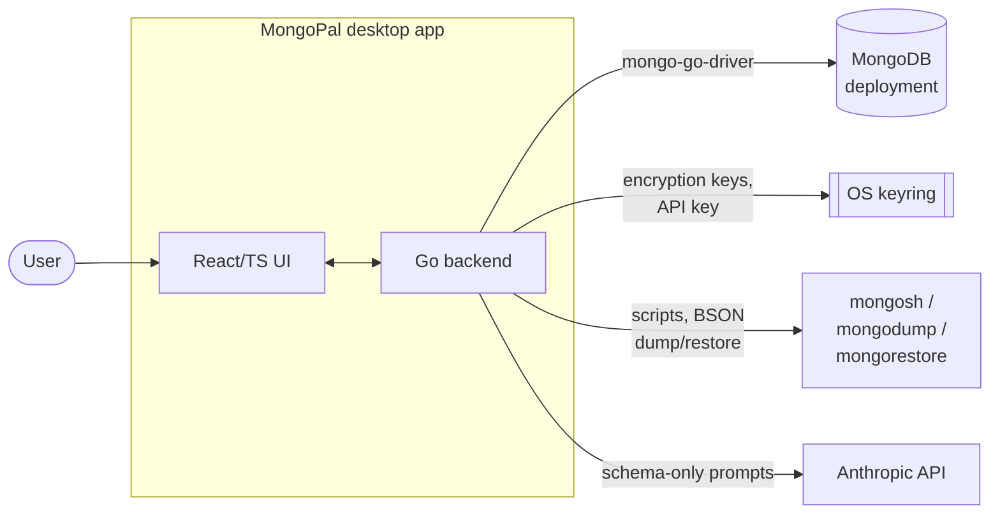
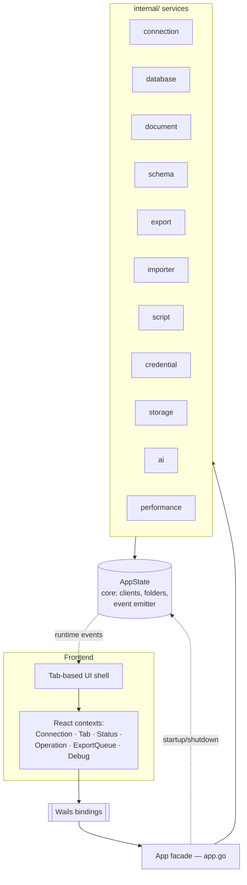

<!-- solution-docs:begin architecture -->
# Architecture

MongoPal is a [Wails v2](https://wails.io) desktop application: a Go backend compiled
into a native binary, driving a React/TypeScript frontend rendered in the platform
webview. The two halves communicate over Wails' generated IPC bindings.

## Context

External dependencies are deliberately optional where possible: MongoDB itself is the
only hard requirement. `mongosh`, `mongodump`, and `mongorestore` are needed only for the
features that shell out to them; the OS keyring degrades gracefully when absent; and the
Anthropic API is used only if the user configures the AI assistant.

## Internal shape

### Components

- **App facade (`app.go`)** — the single class Wails exposes to the frontend. Every
  binding method is a thin delegation to an internal service; the facade owns no business
  logic. It also re-exports the shared types so Wails can generate matching TypeScript.
- **AppState (`internal/core`)** — the central, mutex-guarded state container: the map of
  live MongoDB clients keyed by connection, saved connections and folders, in-flight
  operation handles (with their cancel functions), and the event emitter. Every service
  reads and writes through it, which keeps them decoupled from each other.
- **`internal/` services** — one package per capability (connection, database, document,
  schema, export, importer, script, credential, storage, ai, performance). Each is
  independently testable and knows nothing about Wails IPC.
- **Frontend contexts** — state is split by concern (connection, tabs, status,
  operations, export queue, debug logging) so components subscribe to what they need
  without prop drilling. The UI shell is tab-based, mirroring how databases, collections,
  and documents naturally nest.

## How work flows

**Synchronous requests** (list databases, run a find, save a document) call a binding,
which delegates to a service, which uses the pooled MongoDB client from `AppState` and
returns the result directly.

**Long-running operations** (export, import, schema inference) return immediately and run
in a background goroutine. The service reports progress by emitting events through
`AppState`'s emitter; the Wails runtime forwards them to the frontend, which listens and
updates progress bars and ETAs live. These operations are cancellable — and imports are
pausable — because the facade stores each operation's `context.CancelFunc` in `AppState`
for the frontend to trigger.

## Why this shape

The thin-facade-over-services pattern exists so that business logic never depends on
Wails: services take `AppState` and an event emitter, which makes them unit-testable
without a running desktop shell, and it keeps the IPC surface in one place that
`make generate` can reason about. Centralizing mutable state in `AppState` (rather than
threading it through every service) gives a single source of truth for the connection
pool and lets the event emitter live somewhere every service can reach without circular
imports. The event-driven model for I/O-bound work keeps the UI responsive and is what
makes cancellation and pause/resume expressible.

For the file-level map of packages and components — which this document deliberately does
not duplicate — see [`.claude/rules/mongopal-context.md`](../.claude/rules/mongopal-context.md).

_Generated by solution-docs against commit `1cc8ae0` on 2026-07-03._
<!-- solution-docs:end architecture -->
